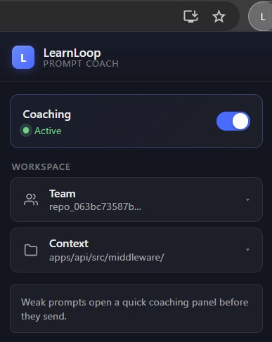
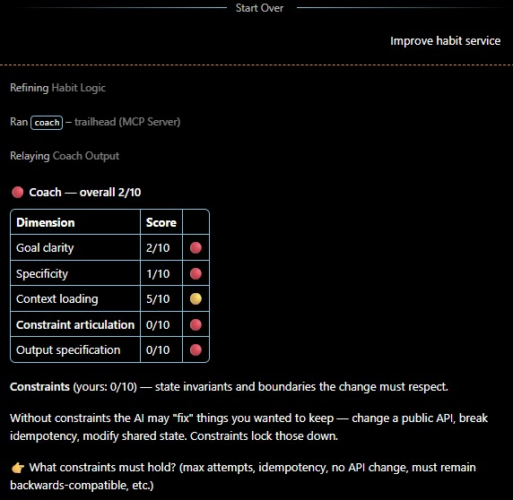

# LearnLoop

A team-wide prompting coach. Every prompt sent through Claude.ai, VS Code,
Claude Code, or Copilot Chat is scored on five dimensions in real time. Weak
prompts trigger a short teaching loop. Strong prompts feed a team wiki, which
gets injected back into the next person's context — so a team's "way of
prompting" compounds without anyone writing docs.

> Trailhead is the engineering codename inside the repo; **LearnLoop** is the
> product name on the marketing site.

- **Landing page / waitlist:** <https://learnloop-gules.vercel.app/>
- **Demo video (3 min walkthrough):** <https://www.youtube.com/watch?v=kD6nnJAmRK8>


### Screenshots

<table>
<tr>
<td width="40%" valign="top">

<br />
<sub><b>Browser-extension popup.</b> Toggle coaching, pick the team, scope scoring to a wiki node so the rubric reads against that subtree's conventions.</sub>
</td>
<td width="60%" valign="top">

<br />
<sub><b>Coach output inside Claude Code.</b> Five dimensions, a per-dimension breakdown, and a teaching paragraph for the weakest one — surfaced through the MCP <code>coach</code> tool before the prompt is sent.</sub>
</td>
</tr>
</table>

---

## The 5-dimension rubric

Every prompt is scored 0–10 on:

1. `goal_clarity` — what outcome is being asked for
2. `specificity` — concrete files, functions, errors named
3. `context_loading` — relevant code/docs/examples attached
4. `constraint_articulation` — what *must not* change, perf/style limits
5. `output_specification` — desired shape of the response

`overall = mean of the five dims`. Below 7 triggers coaching; ≥ 7 lands
silently. The rubric is concrete enough that a human reviewer could apply it —
the LLM is the implementation, not the product.

---

## What's actually implemented

The repo is a working npm-workspaces monorepo. Six surfaces, all wired to one
backend, all sharing the same TypeScript contract.

### `apps/api` — Hono backend (TypeScript, Node 22, Postgres)

Single source of truth. Multi-tenant by `X-Team-Token` header, with optional
auto-creation of new teams on unknown tokens (`TRAILHEAD_AUTO_CREATE_TEAMS`).
Endpoints implemented in `apps/api/src/index.ts`:

| Method + Path | What it does |
|---|---|
| `GET  /` | Health + endpoint catalog (unauth) |
| `GET  /teams` | Resolves the caller's own team (authenticated). Never returns tokens — `{ name, id }` where `id` is an opaque digest |
| `POST /score` | 5-dimension Gemini score; writes `skill_observation` rows with a 30 s per-dimension dedup window |
| `POST /coach` | Stateless 3-round teach→reveal coaching loop |
| `POST /capture` | Stores a `(prompt, response, outcome)` capture from any surface |
| `POST /wiki/propose` | Normalize + dedup an insight on `(node_id, body_normalized)`, increment `reinforcement_count`, promote `draft → durable` at ≥ 3 |
| `GET  /context?path=` | Ancestor walk: returns every wiki node whose path is a prefix of the file path, plus its durable learnings |
| `GET  /examples?path=` | Top graduated prompts for an ancestor of a file path |
| `GET  /wiki/recent?since=ISO` | Polling endpoint for the VS Code wiki-toast surface |
| `POST /diff` | Picks the closest graduated team prompt by topic + ancestry, scores both prompts, asks Gemini to narrate the difference |
| `POST /improve` | Multi-turn Gemini-driven prompt rewrite, capped at 5 user replies |
| `GET  /skill-arc` | Time-series of per-dimension scores (powers the dashboard hero chart) |
| `GET  /team/metrics` | Snapshot: avg overall, reuse rate, durable count, draft count, active users |
| `GET  /wiki/tree` | Full node + learnings tree |
| `GET  /wiki/export` | The whole team wiki as one markdown document (`?drafts=true`, `?format=json`) |
| `POST /onboard/repo` | Bulk-upsert one node per path, idempotent, optional `initial_rules[path]` for seeding `body_md` |
| `POST /onboard/repo/full` | Async rich bootstrap: accepts a folder + file bundle (capped at 16 MB / 2 000 files / 32 KB per file), enqueues a `wiki_jobs` row, three-pass Gemini fan-out via `setImmediate` |
| `GET  /onboard/jobs/:id` | Per-path progress for a rich-bootstrap job |
| `DELETE /team/data` | Wipes the requesting team's data; demo team is protected unless `TRAILHEAD_ALLOW_DEMO_RESET=true` |

LLM work runs through `apps/api/src/gemini.ts`. Model assignments live in
`packages/scoring/src/models.mjs`: `gemini-3-flash-preview` for scoring
(JSON-schema mode), topic extraction and diff narration; `gemma-4-31b-it` for
async learning extraction, where latency is tolerable.

Every Gemini call is instrumented with **Langfuse** when
`LANGFUSE_PUBLIC_KEY` / `LANGFUSE_SECRET_KEY` are set — one trace per HTTP
request, one nested generation per LLM call, with token usage and latency.
Tracing silently no-ops when keys are missing.

### `apps/browser-ext` — Chrome MV3 extension for Claude.ai

Vanilla TypeScript + esbuild. Manifest declares `https://claude.ai/*` as the
content-script host and allowlists `http://localhost/*` for a self-hosted API.
The popup's **API server** row shows and edits that URL.

Implemented widgets (`src/widgets/`):

- **Score card** under the textarea — scores on send (not on keystroke),
  per-dimension bars, missing-dimension hints
- **Score badge** on each user bubble
- **Prompt diff panel** — "Compare to team" expands a `/diff` view inline
- **Outcome rating** chips on each assistant bubble (👍 / 🤷 / 👎 → `/capture`)
- **Wiki toast** — drops in when `/wiki/recent` polling sees a new learning
- **Improve chat** — multi-turn rewrite using `/improve`
- **Context pill + popup** — pick a wiki node to bias scoring
- **Send-intercept** — on send: `≥ 7` lets the native send fire; `< 7` keeps the
  score card up with *Improve* / *Send as-is* / *Edit* and waits for the user.
  There is no timer and nothing is ever sent automatically. Fail-open on every
  API error.

Kill-switch: `chrome.storage.local.set({ 'trailhead.disabled': true })` halts
the extension on next page load.

### `apps/vscode-ext` — VS Code extension

Sidebar webview registered under the `trailhead` activity bar. Settings expose
`trailhead.apiUrl`, `trailhead.teamToken`, `trailhead.userId`. Same 5-dimension
score-card render as the browser extension, plus a wiki-diff polling loop that
toasts when `/wiki/recent` reports a new insight.

### `apps/mcp-server` — MCP server for Claude Code + Copilot Chat

STDIO MCP server. Five hero tools, deliberately collapsed from a previous
seven-tool surface so Copilot's tool selector picks reliably:

| Tool | Routes to |
|---|---|
| `coach` | `POST /coach` — server-side teach→reveal cycle returns `proceed: true/false` and a rendered `text` block; the directive is a thin "relay text, follow `proceed`" loop |
| `wiki_lookup` | `GET /context` + `GET /examples` (file-path based) and/or `GET /search` (query) |
| `wiki_save` | `POST /wiki/propose` with server-side dedup |
| `wiki_bootstrap` | `POST /onboard/repo` (skeleton) or `POST /onboard/repo/full` (rich, LLM-populated) |
| `wiki_proven_prompts` | `GET /prompts/proven` — the team's graduated prompts, filterable by score, path and topic |

Plus a `ping` for health checks.

> **Not published to npm.** The package is `private: true` and neither
> `trailhead-mcp` nor `@trailhead/mcp-server` exists on the registry, so
> `npx trailhead-mcp` does not work. Run it from a clone — see
> [SELFHOSTING.md](SELFHOSTING.md).

CLI subcommands (`bin/cli.mjs`):

- `trailhead-mcp init` — per-repo install. Writes `.mcp.json` + `CLAUDE.md`
  for Claude Code and `.vscode/mcp.json` + `.github/copilot-instructions.md`
  for Copilot. Idempotent. Token derivation order: `--team-token` →
  `TRAILHEAD_TEAM_TOKEN` → `.trailhead-team` sentinel → SHA-256 of
  `git remote get-url origin` → random `repo_local_*` token written to
  `.trailhead-team` and added to `.gitignore`.
- `trailhead-mcp bootstrap` — walks the cwd, bundles source files, posts to
  `/onboard/repo/full`. Default rich mode shows a live progress bar. Flags:
  `--minimal`, `--paths`, `--force`, `--dry-run`, `--yes`.
- `trailhead-mcp reset` — wipes the team's wiki/captures/observations.

### `apps/dashboard` — Next.js 15 dashboard (Vercel)

App router, server components for the team list, SWR for the live charts.
Pages (`src/app/`):

- `/` — team picker (lists every team returned by `/teams`)
- `/skill-arc?team=…` — per-dimension team chart driven by `/skill-arc`,
  polls every 2 s during the demo
- `/team?team=…` — L1→L2 metric cards from `/team/metrics`
- `/wiki?team=…` — node tree + durable learnings from `/wiki/tree`

### `apps/landing-page` — LearnLoop marketing site

Single static `index.html` + JSX components loaded at runtime via Babel
standalone. Tailwind via CDN. Sections: hero, problem, solution, features,
demo, footer. Deployed at <https://learnloop-gules.vercel.app/>.

### Packages

- `packages/shared` — TypeScript types for every API request/response. Every
  surface imports from here so wire shapes can't drift.
- `packages/scoring` — Locked Gemini prompt templates (score, augment, teach,
  topic, extract) and pure helpers (`buildAugmentation`, `normalize`,
  `normalizePath`, `ancestorPaths`, the teach/skip/success reveal renderers).
- `packages/score-card` — Pure-DOM render function for the 5-dimension card.
  Used by the browser extension and the VS Code webview.
- `packages/db` — `schema.sql` (idempotent, every `CREATE` uses `IF NOT
  EXISTS`), `migrate.mjs`, `check.mjs`, and `seed.mjs` for the Acme Fintech
  demo data.

### Database (Postgres on Neon)

Eight tables in `packages/db/schema.sql`:

- `teams` — tenancy
- `nodes` — one row per folder or file path; carries `body_md`
- `learnings` — accumulated insights with normalize-based dedup, counter,
  and `draft | durable` status
- `prompts` — graduated prompt templates with `topic` and `reuse_count`
- `captures` — stored conversations with outcome
- `skill_observations` — per-dimension score writes; `prompt_hash` backs the
  30 s dedup window
- `wiki_jobs` + `wiki_job_paths` — async rich-bootstrap state

The demo team (`Acme Fintech`, token `trailhead_demo_acme_2026`) is hardcoded
into the schema with a fixed UUID so every surface can reference it without a
lookup.

---

## Repository layout

```
apps/
  api/           Hono + TypeScript backend (Railway)
  browser-ext/   Chrome MV3 extension for Claude.ai
  vscode-ext/    VS Code IDE extension
  mcp-server/    MCP server (Claude Code + Copilot Chat) + CLI
  dashboard/     Next.js 15 dashboard (Vercel)
  landing-page/  Static marketing site (LearnLoop)
packages/
  shared/        TypeScript types — single source of truth for API shapes
  scoring/       Locked Gemini prompt templates + pure helpers
  score-card/    Pure-DOM render of the 5-dimension card
  db/            Postgres schema, migrations, seed data
docs/
  superpowers/specs/   Design specs
  roadmaps/            Per-surface 24h build roadmaps
```

---

## Quick start

Trailhead is self-hosted. There is no hosted backend to sign up for — you run
the API, and every client points at it.

### The short way: Docker

Everything you need is Docker and a Gemini API key from
<https://aistudio.google.com/apikey>.

```bash
cp .env.example .env     # then put your Gemini key in it
docker compose up
# → API on http://localhost:3000, Postgres schema applied automatically
```

That is the whole setup. See [SELFHOSTING.md](SELFHOSTING.md) for pointing the
browser extension, VS Code extension, MCP server and dashboard at it, and for
running against an external database instead.

### The long way: local Node + your own Postgres

Prerequisites:

- Node `>= 22.6`
- A Postgres database (Neon — `DATABASE_URL` must include `sslmode=require`)
- A Gemini API key from <https://aistudio.google.com/apikey>

```bash
# 1. Install workspace dependencies
npm install

# 2. Configure environment
cp .env.example .env
# Edit .env — fill in DATABASE_URL and GEMINI_API_KEY

# 3. Apply the schema (idempotent, safe to re-run)
psql "$DATABASE_URL" -f packages/db/schema.sql

# 4. (optional) Seed the Acme Fintech demo data
node packages/db/seed.mjs

# 5. Run the API
npm run dev
# → http://localhost:3000
```

The API refuses to boot without `DATABASE_URL` and `GEMINI_API_KEY`.

### Run individual surfaces

```bash
# Dashboard (Next.js, port 3001)
NEXT_PUBLIC_API_URL=http://localhost:3000 \
NEXT_PUBLIC_TEAM_TOKEN=trailhead_demo_acme_2026 \
  npm --workspace=apps/dashboard run dev

# Browser extension — build, then load apps/browser-ext/dist as unpacked
npm --workspace=@trailhead/browser-ext run build
# chrome://extensions → Developer mode → Load unpacked → apps/browser-ext/dist/

# VS Code extension — build, then F5 with apps/vscode-ext as the workspace
npm --workspace=apps/vscode-ext run build

# MCP server — install into a target repo
cd /path/to/your/repo
npx trailhead-mcp init
npx trailhead-mcp bootstrap
```

### Workspace scripts

```bash
npm run typecheck    # tsc --noEmit across all workspaces
npm run test         # run all workspace tests
npm run build        # build all workspaces that expose a build script
```

---

## Environment variables

Single root `.env.example` — every surface reads from the same set.

| Var | Used by | Notes |
|---|---|---|
| `DATABASE_URL` | api | Postgres connection string, `sslmode=require` |
| `GEMINI_API_KEY` | api | `gemini-3-flash-preview` + `gemma-4-31b-it` |
| `LANGFUSE_PUBLIC_KEY` | api | Optional. Hosted Langfuse public key (`pk-lf-…`) |
| `LANGFUSE_SECRET_KEY` | api | Optional. Hosted Langfuse secret key (`sk-lf-…`) |
| `LANGFUSE_BASEURL` | api | Defaults to `https://cloud.langfuse.com` (EU). Use `https://us.cloud.langfuse.com` for US |
| `TEAM_TOKEN` | clients | Demo single-tenant secret, sent as `X-Team-Token` |
| `PORT` | api | Defaults to 3000; Railway injects automatically |
| `TRAILHEAD_AUTO_CREATE_TEAMS` | api | `false` to disable on-the-fly team creation |
| `TRAILHEAD_ALLOW_DEMO_RESET` | api | `true` to allow `DELETE /team/data` on the demo team |
| `NEXT_PUBLIC_API_URL` | dashboard | Where the dashboard fetches |
| `NEXT_PUBLIC_TEAM_TOKEN` | dashboard | Team token surfaced to the browser |
| `trailhead.apiUrl` / `.teamToken` / `.userId` | vscode-ext | VS Code settings |
| `TRAILHEAD_API_URL` / `TRAILHEAD_TEAM_TOKEN` | mcp-server | Per-repo MCP config |

---

## Deployment

- **API** → Railway. `railway.json` declares `npm --workspace=apps/api start`
  with healthcheck on `/`.
- **Dashboard** → Vercel. Set `NEXT_PUBLIC_API_URL` and
  `NEXT_PUBLIC_TEAM_TOKEN`, then `vercel --prod` from `apps/dashboard/`.
- **Landing page** → Vercel — already live at
  <https://learnloop-gules.vercel.app/>.
- **Browser extension** → loaded unpacked from `apps/browser-ext/dist/`.
- **VS Code extension** → `vsce package` from `apps/vscode-ext/`.
- **MCP server** → distributed via `npx trailhead-mcp init` (per-repo wiring,
  multi-tenant token derivation from the git remote).

---

## How the pieces fit

1. Engineer types a prompt and hits send. The extension intercepts the send and
   calls `/score`. The card mounts under the textarea with five per-dimension
   bars and missing-dimension hints.
2. `≥ 7` sends straight through. Below 7 the card stays up with *Improve* /
   *Send as-is* / *Edit* and waits for an explicit choice — no timer, no
   auto-send. Each `/score` writes 5 `skill_observation` rows; the dashboard's
   `/skill-arc` chart polls every 2 s, so the rightmost bucket climbs as the
   user prompts.
3. In Claude Code or Copilot Chat, the MCP server's `coach` tool is called
   first. Server returns `proceed: false` plus a teach-block when the score
   is low; the host LLM relays the block, gathers a reply, calls back. Three
   rounds max, then a reveal block shows the score arc and prompt diff.
4. When the user states a teamwide convention, `wiki_save` calls
   `POST /wiki/propose`. Server-side normalize + dedup means repeated calls
   reinforce the same draft instead of duplicating; `reinforcement_count >= 3`
   promotes `draft → durable`. The VS Code extension polls `/wiki/recent` and
   toasts the update — visible proof of the autonomous loop.
5. Next prompt the same engineer (or a teammate) types in the same path
   triggers `/score` again, but now `context_path` pulls the team's HCL
   bundle into Gemini's system prompt, so the rubric is calibrated against
   the team's own conventions.

---

## Specs

The project was specced before it was built. Source of truth for *why*:

- `docs/superpowers/specs/2026-04-25-trailhead-design.md` — master spec
- `docs/superpowers/specs/2026-04-25-mcp-plugin-ux-design.md` — MCP install
  story and (then) four-tool surface
- `docs/superpowers/specs/2026-04-25-trailhead-browser-ext-design.md` —
  Claude.ai content-script architecture
- `docs/superpowers/specs/2026-04-25-demo-completion-design.md` — dashboard
  and seeding plan
- `docs/superpowers/specs/2026-04-26-trailhead-educational-loop-design.md` —
  the teach → reveal coaching loop
- `docs/superpowers/specs/2026-04-26-wiki-bootstrap-rich-design.md` — async
  rich bootstrap
- `docs/superpowers/specs/2026-04-26-improve-widget-design.md` — multi-turn
  improve widget
- `docs/roadmaps/` — per-surface 24-hour build plans

Each app and package also has its own `README.md` covering surface-specific
contracts, builds, and tests.

---

## Tech stack

- **Backend:** Hono, TypeScript, Node 22, `@hono/node-server`, raw `pg`
- **DB:** Postgres on Neon, no ORM
- **LLMs:** `gemini-3-flash-preview` (scoring, JSON-schema mode), `gemma-4-31b-it`
  (diff narration, rich bootstrap)
- **Observability:** Langfuse (hosted) — one trace per request, one
  generation per LLM call
- **Frontend:** Next.js 15 + Tailwind + Recharts + SWR (dashboard); vanilla
  TS + esbuild (extensions); React via CDN (landing page)
- **MCP:** `@modelcontextprotocol/sdk`, STDIO transport
- **Build:** npm workspaces; per-package `tsc` / `esbuild`
- **Hosts:** Railway (API), Vercel (dashboard + landing page), per-repo MCP
  install via `npx trailhead-mcp`
